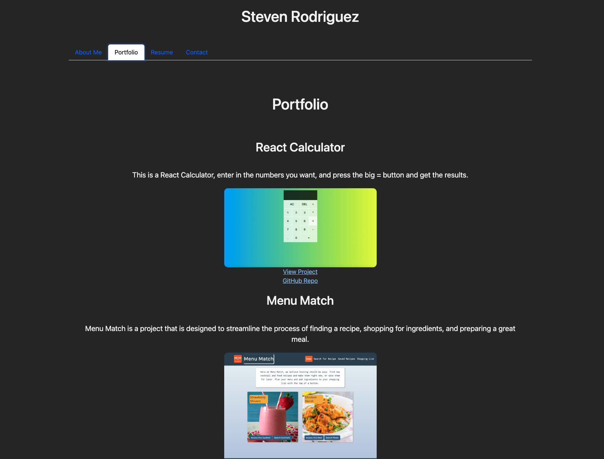

# ReactPortfolio

https://stevenrodriguezdev.github.io/Portfolio/

## Description

This is My personal React Portfolio to display my recent projects.

- The purpose of this was to host all my projects in one place

## Table of Contents (Optional)

- [Installation](#installation)
- [Usage](#usage)

## Installation
n/a

## Usage
n/a

My portfolio is a compilation of academic and professional materials that exemplifies beliefs, skills, qualifications, education, training, and experiences. It provides insight into my personality and work ethic.
Include screenshots as needed.

